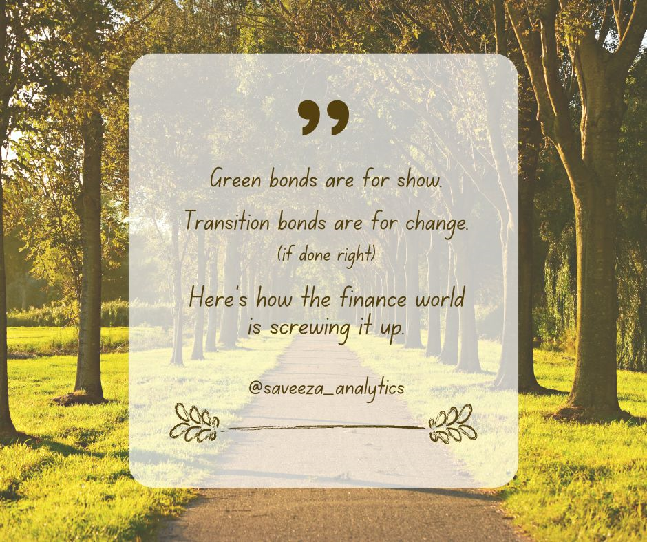

# 🌱 From Greenwashing to Real Impact — Why Transition Bonds Matter

> **A data-driven, research-backed analysis of transition bonds, exploring global issuance trends, credibility gaps, and real-world policy risks.**  
> Combines financial data analysis, ESG research, and narrative commentary to test whether transition bonds deliver real sustainability impact.

---

## 📑 **About This Project**

This project expands on my published article:  
👉 [From Greenwashing to Real Impact — Why Transition Bonds Matter](https://www.linkedin.com/pulse/from-greenwashing-real-impact-why-transition-bonds-saveeza-chaudhry--pbblf)

It goes beyond narrative to apply:
- Quantitative data analysis (issuance trends, ESG scores)
- Visualization of market growth vs. policy credibility
- Commentary rooted in policy frameworks & standards (e.g., CBI, EU Taxonomy)
- *Real references & external datasets* (as cited in article)

---

## 📊 **What makes this project unique**
✅ Combines financial analysis & policy research  
✅ Tests real-world data against narrative claims  
✅ Focuses on **impact** — not just issuance volume  
✅ Links directly to published article → shows communication & research skills  
✅ Fully documented, with references & context

---

## 🧰 **Project Structure**

- `data/` → Dataset on global transition bond issuance & ESG scores
- `notebooks/` → Jupyter notebook:
  - Issuance growth analysis (2019–2024)
  - ESG rating correlation
  - Sector-level exposure
  - Commentary on credibility risk
- `requirements.txt` → Python libraries
- `LICENSE` → Project license
- `README.md` → This file

---

## 🌍 **Context & real-life relevance**
Transition bonds are widely marketed as the “bridge” to decarbonization — but questions remain about:
- Alignment with **EU Green Bond Standard & CBI taxonomy**
- Use-of-proceeds vs. actual impact
- Heavy industry issuers & credibility gap
- Policy risk from future regulation

This project uses data analysis to test if market growth matches *real decarbonization potential* — a key skill in sustainable finance & ESG risk analytics.

---

## 🔗 **Part of my ESG & transition bonds research series**

- 🌱 [Transition Bonds Europe: Gap, Risk, Data & Policy Analysis](https://github.com/Saveeza/transition-bonds-europe-gap-risk-data-policy-analysis)
- 🇪🇺 [Transition Bonds: The New Greenwashing?](https://www.linkedin.com/pulse/transition-bonds-new-greenwashing-how-europes-bond-market-chaudhry--sqdvf)

---

## 📦 **Technical tools & skills demonstrated**
- Python (pandas, matplotlib, seaborn)
- Data cleaning & aggregation
- Correlation & descriptive analytics
- ESG policy research & external referencing
- Communicating results for non-technical audiences

---

## 🙌 **Why this matters (call to action)**
Understanding *where transition bonds succeed — and where they risk greenwashing —* is critical for sustainable finance.  
This project shows how data & policy analysis together can support **credible investment decisions**.

---

## 📚 How to Cite

Aziz, S. (2025). *Saveeza/transition-bonds-impact-analysis: Initial Zenodo Release — Transition Bond Impact Assessment (EU) (v1.0)*. Zenodo. https://doi.org/10.5281/zenodo.16150635

---

## ✅ **Status**

✅ Repository created and structured
✅ Article published
✅ Data and visuals uploaded
📊 Notebook analysis completed
📌 References included

---

## 👤 About the Author

**Saveeza Aziz** is a data analyst with a focus on sustainable finance and applied policy evaluation. Her work combines technical expertise in ESG scoring, EU Taxonomy alignment, and investment modeling to support real-world financial decisions. She has contributed to projects on the real estate market in Luxembourg, the green transport transition in Germany, and the credibility challenge of transition bonds held by Dutch pension funds. Her approach bridges regulatory frameworks and market performance through data-driven insights that are both practical and impact-focused — especially in areas like green finance accountability, disclosure enforcement, and policy-aligned investment strategies.

---

*For collaboration, questions or discussion, feel free to reach out!*

